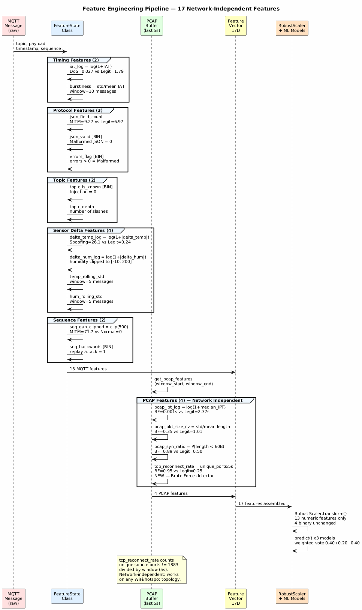
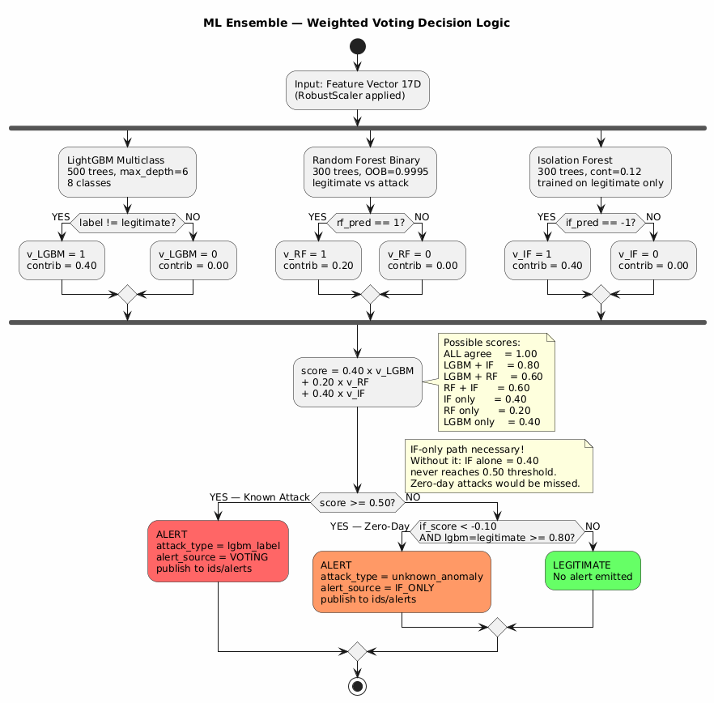
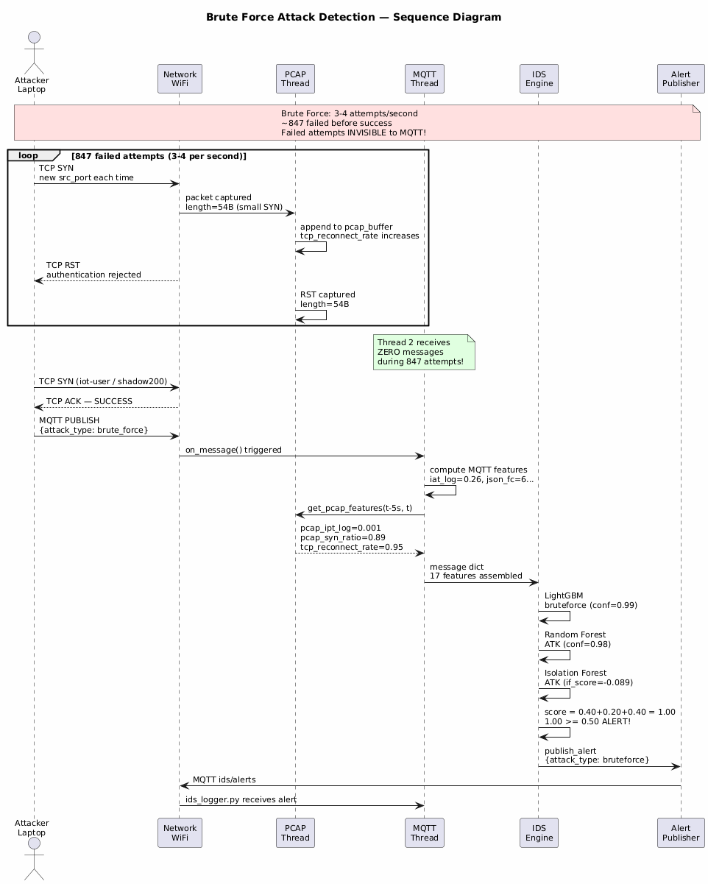
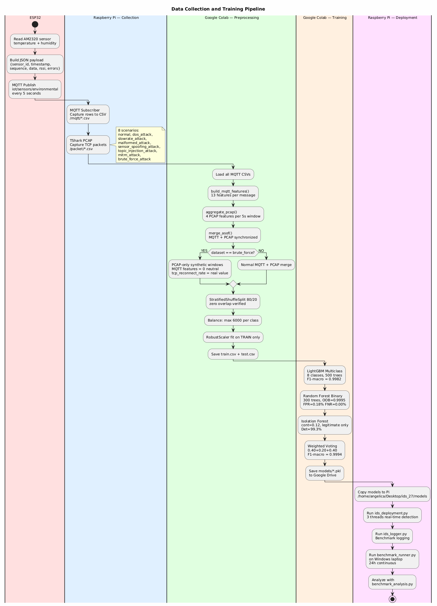

# IoT IDS — UML Diagrams for Dissertation Thesis

Real-Time Intrusion Detection System for MQTT-based IoT environments  
Raspberry Pi 5 + ESP32 + AM2320 | LightGBM + Random Forest + Isolation Forest

---

## Diagram 1 — System Architecture

This diagram illustrates the complete architecture of the proposed IoT IDS system.
The system consists of three physical components connected via a local WiFi network.
The ESP32 microcontroller with AM2320 sensor publishes temperature and humidity data
every 5 seconds to the Mosquitto broker running on Raspberry Pi 5.
The attacker laptop simulates seven attack types through the same broker port 1883.
On the Raspberry Pi, three parallel threads handle detection: Thread 1 captures TCP
packets via pyshark, Thread 2 receives MQTT messages and computes 13 behavioral
features, and Thread 3 applies three ML models combined through weighted voting
(LightGBM 0.40 + Random Forest 0.20 + Isolation Forest 0.40) and emits alerts
on topic ids/alerts. The ids_logger.py component records every prediction to
ids_predictions.csv for benchmark analysis.

---

## Diagram 2 — Feature Engineering Pipeline

This diagram details how raw MQTT messages and PCAP packets are transformed into
the 17-dimensional feature vector used by the ML models. The FeatureState class
maintains sliding windows and computes 13 MQTT features grouped in five categories:
timing (iat_log, burstiness), protocol (json_field_count, json_valid, errors_flag),
topic (topic_is_known, topic_depth), sensor delta (delta_temp_log, delta_hum_log,
temp_rolling_std, hum_rolling_std), and sequence (seq_gap_clipped, seq_backwards).
Four PCAP features are extracted from packets captured in the last 5-second window:
pcap_ipt_log, pcap_pkt_size_cv, pcap_syn_ratio, and tcp_reconnect_rate.
The feature tcp_reconnect_rate is a novel contribution introduced to detect Brute
Force attacks at TCP level — it counts unique source ports per second and is
network-independent, working across different WiFi topologies.
The 13 numeric features are scaled with RobustScaler fitted exclusively on the
training set, respecting the non-leakage principle.

---

## Diagram 3 — ML Ensemble Decision Logic

This activity diagram presents the weighted voting decision mechanism at the core
of the IDS engine. Each of the three models contributes a weighted vote and an
alert is emitted if the aggregated score reaches or exceeds 0.50, requiring
confirmation from at least two models. No single model can trigger an alert alone:
LightGBM + Isolation Forest produces 0.80, LightGBM + Random Forest produces 0.60,
Random Forest + Isolation Forest produces 0.60, while Isolation Forest alone produces
only 0.40. A secondary path allows Isolation Forest to alert independently when it
detects a strong anomaly (if_score below -0.10) that supervised models classify as
legitimate with high confidence (lgbm_conf above 0.80). This is the zero-day
detection mechanism: without it, unknown attacks invisible to LightGBM and Random
Forest would be silently ignored despite Isolation Forest detecting them as anomalies.

---

## Diagram 4 — Brute Force Attack Detection Sequence

This sequence diagram illustrates the detection flow for the Brute Force attack,
architecturally the most complex scenario in the system. The 847 failed
authentication attempts are completely invisible to the MQTT subscriber thread
because the Mosquitto broker rejects the TCP connection before any MQTT packet
is exchanged, so Thread 2 receives zero messages during this phase. The detection
relies entirely on PCAP features: the PCAP thread captures small SYN/RST packets
(54 bytes each), tcp_reconnect_rate accumulates to approximately 0.95 connections
per second, pcap_syn_ratio reaches 0.89, and pcap_ipt_log drops to 0.001.
Upon the first successful authentication, the attacker publishes an MQTT message
which triggers Thread 2 to integrate PCAP features from the previous 5-second
window. All three models detect the characteristic pattern with a combined voting
score of 1.00. This scenario motivated the introduction of tcp_reconnect_rate
as a dedicated Brute Force feature at TCP level.

---

## Diagram 5 — Data Collection and Training Pipeline

This activity diagram presents the complete end-to-end pipeline from raw data
collection to production deployment. The ESP32 publishes sensor data continuously
for 8 scenarios (1 normal and 7 attack types). Data is captured simultaneously
at two levels: MQTT messages saved as CSV rows and TCP packets captured as PCAP
files. In Google Colab, the preprocessing pipeline applies build_mqtt_features()
to extract 13 MQTT features and aggregate_pcap() to extract 4 PCAP features per
5-second window, synchronized via merge_asof(). Brute Force receives special
treatment: since failed attempts generate no MQTT traffic, synthetic PCAP-only
windows are created with neutral MQTT features and real tcp_reconnect_rate values.
After stratified 80/20 splitting and RobustScaler normalization fitted exclusively
on the training set, three models are trained achieving Weighted Voting F1-macro
of 0.9994 with FPR of 0.20% and FNR of 0.00%.

---

## Test Results

37 unit tests validate the feature engineering logic across 7 test classes:
IAT features, sensor features, topic features, PCAP features, sequence features,
voting logic, and feature list properties. All tests pass, verifying consistency
between the preprocessing pipeline and the deployment system.

---

## Attack Detection Results

| Attack | Detection Rate | Primary Features |
|--------|:--------------:|-----------------|
| DoS Flood | 100% | iat_log, pcap_ipt_log |
| Slow-Rate DoS | 100% | iat_log, burstiness |
| Malformed MQTT | 100% | errors_flag, delta_temp_log |
| Sensor Spoofing | 100% | delta_temp_log, temp_rolling_std |
| Topic Injection | 100% | topic_is_known, topic_depth |
| Man-in-the-Middle | 100% | seq_gap_clipped, seq_backwards |
| Brute Force | 100% | tcp_reconnect_rate, pcap_syn_ratio |