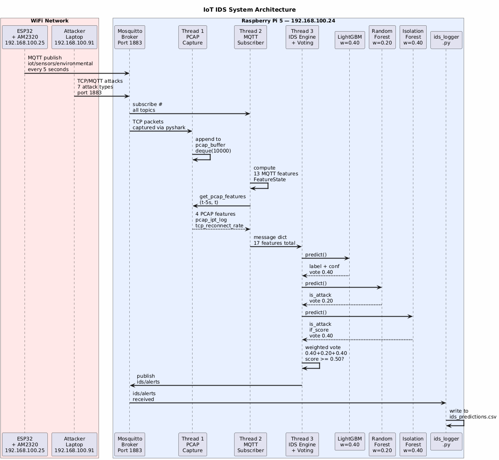

# iot-ids-diagrams

---

## CI/CD Workflow

The GitHub Actions workflow automatically:
1. Installs Java 17 and Graphviz
2. Downloads PlantUML and generates PNG images from all `.puml` files
3. Uploads generated diagrams as downloadable artifacts
4. Runs 37 unit tests validating feature engineering logic

---

## Diagram 1 — System Architecture

### Description

This diagram illustrates the complete architecture of the proposed IoT IDS system.
The system consists of three physical components connected via a local WiFi network:

- **ESP32 + AM2320**: publishes temperature and humidity data every 5 seconds
  to the Mosquitto broker on topic `iot/sensors/environmental`
- **Attacker Laptop**: simulates seven attack types through the same broker port 1883
- **Raspberry Pi 5**: runs both the Mosquitto broker and the IDS system

On the Raspberry Pi, three parallel threads handle detection:
- **Thread 1** captures TCP packets via pyshark on interface `any`, port 1883
- **Thread 2** receives MQTT messages and computes 13 behavioral features
- **Thread 3** applies three ML models combined through weighted voting
  (LightGBM 0.40 + Random Forest 0.20 + Isolation Forest 0.40)
  and emits alerts on topic `ids/alerts`

The `ids_logger.py` component subscribes to all topics and records
every prediction to `ids_predictions.csv` for benchmark analysis.

### PlantUML Source

See [`diagrams/1_system_architecture.puml`](diagrams/1_system_architecture.puml)

---